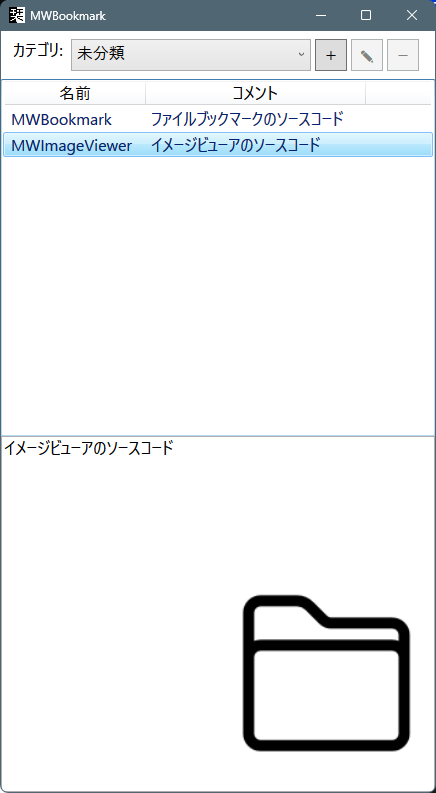

# MWBookmark

Windows向けのシンプルなブックマーク管理アプリです。

ファイル、フォルダ、ZIPファイルをカテゴリごとに整理し、コメント付きで管理できます。

## Features

* ファイル・フォルダのブックマーク登録
* ドラッグ＆ドロップによる簡単登録
* カテゴリ管理

  * 追加
  * 名前変更
  * 削除
* コメント編集
* コピー／切り取り／貼り付けによるカテゴリ移動
* ダブルクリックで関連付けアプリから開く
* 画像プレビュー
* フォルダ内の先頭画像をサムネイル表示
* ZIPファイル内の先頭画像をプレビュー表示
* LiteDBによるローカルデータ保存
* サムネイルキャッシュ機能

## Screenshot



※ スクリーンショットは任意で差し替えてください。

---

## Requirements

* Windows 10 / 11
* .NET 10 Runtime

## Build

```bash
git clone https://github.com/yourname/MWBookmark.git
cd MWBookmark

dotnet restore
dotnet build -c Release
```

公開用ビルド:

```bash
mkdir Publish
dotnet build MWBookmark.csproj -c Release -o Publish
```

## Usage

### ブックマーク追加

ファイルまたはフォルダを一覧へドラッグ＆ドロップします。

### カテゴリ管理

上部のカテゴリ欄から

* ＋ : カテゴリ追加
* ✎ : カテゴリ名変更
* － : カテゴリ削除

を行えます。

### コメント編集

一覧で項目を選択すると下部のテキストエリアからコメントを編集できます。

### 開く

一覧項目をダブルクリックすると、Windowsの関連付けアプリで開きます。

## Data Storage

データはLiteDBを使用してローカル保存されます。

### Bookmark Database

```text
Bookmarks.db
```

### Thumbnail Cache

```text
image-cache.db
```

## Technologies

* WPF
* .NET 10
* ReactiveProperty
* LiteDB

## License

Apache 2.0 License

## Author

Maywork
